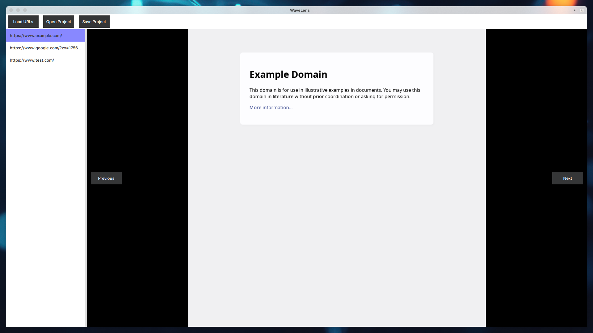

## WaveLens (pronounce similar to Wave Length)

 
WaveLength Tool

WaveLength is a tool for taking screenshots, the goal is to make it easy to use and fast, unlike other tools that use a delay to make sure the page is loaded, this tool takes a different approach, it takes advantage of the fact that when the page is still not rendered, the screenshot is an image filled with white pixels only.

## Features
- GUI for taking screenshots for a list of URLs loaded from a file.
- The project can be saved in a single file containing all the screenshots.
- The file is a simple sqlite database with the images stored as blobs.

 
WaveLength Tool

You 